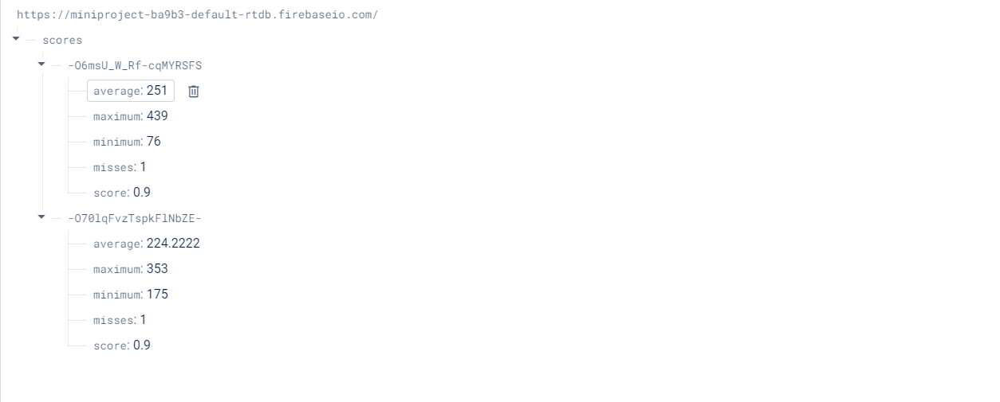

**Exercise 1**
The max_bright value found was roughly around 500 and the min_bright value found was roughly around 54000   
To find the max_bright value, we placed our phone flashlight over the photoresistor and saw the output drop to roughly around the 500 range. To find the min_bright value, we cupped our hands over the sensor. We had to make sure not to place our finger on it since it would have difficulty in giving us the minimum brightness values. 

**Exercise 2**
We referenced this [pico songs github repo](https://github.com/twisst/pico-songs) when building our project and then searched through the library of songs and settled on the Tetris theme song.   
When playing through the song for the first time, we realized it was a little bit too slow and didn't really sound like the theme song at all. As a result, we lowered the delay between the notes and got the speaker to play the song pretty accurately  

Our demo video is in this [link](https://drive.google.com/file/d/1xk_GzqQL8fyXfyxR3hSDeNnSl-JIoJYw/view?usp=sharing). 

**Exercise 3**
1. We used the min and max functions to find the best and worst score of the 10 attempts. We also used the sum and divided it by the amount of good attempts to calculate the average and the score. The min, max, average, score, and total misses were place all inside of a json file which was then sent to our Firebase realtime database.   

2. We used Google's Firebase to host our server and connected it to our Raspberry Pi Pico WH. This was possible by first connecting the Rasp Pi to the BU Guest network. This was done to avoid applying our BU Kerberos authentication every single time. We then created our Firebase project and connected our database to our microcontroller by using Firebase REST API. We sent over the json file using the urequests library.  

3. After getting a couple runs in. We can see in the picture below that the scores.json file was being sent over to the database.  

   

The two pictures below will show the wiring of the game and also what the Thonny IDE displays while the game is playing and completed.

